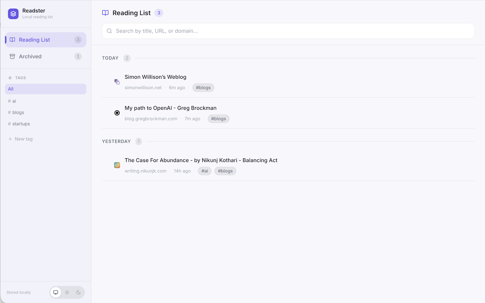
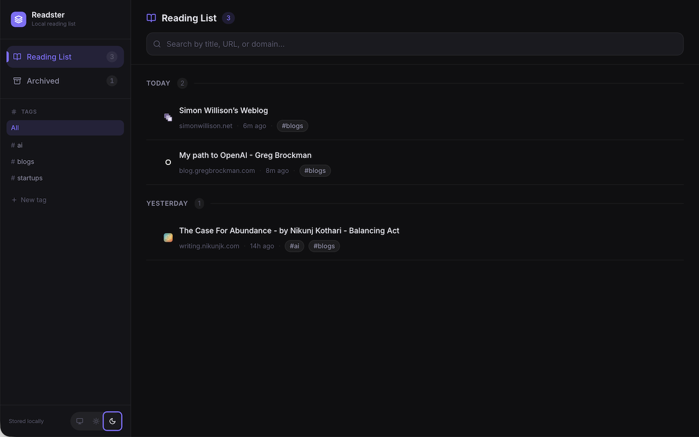
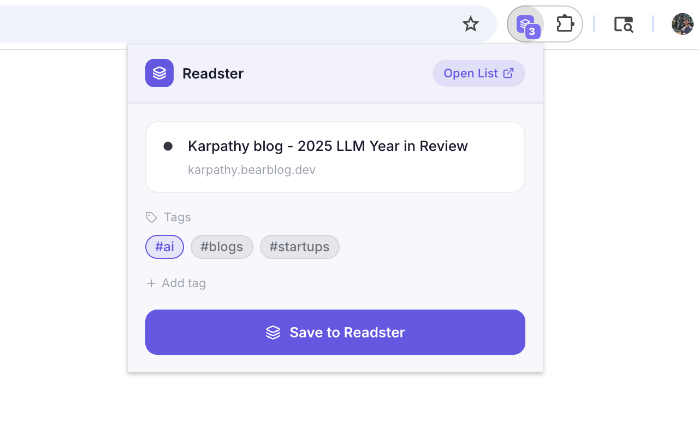

# Readster

A beautiful, local-first reading list manager for Chrome and Edge.

Save pages with one click, organise them with tags, and archive what you've read — all stored in your browser with no account or cloud sync required.

## Screenshots

<p align="center">
  
</p>
<p align="center">
  
</p>
<p align="center">
  
</p>

---

## Features

- **One-click save** — click the toolbar icon on any page to save it instantly
- **Tag system** — create and filter by tags across your reading list
- **Archive flow** — check off items with a spring animation; they move to an archived view
- **Date grouping** — items organised as Today / Yesterday / This Week / Month Year
- **Real-time search** — filter by title, URL, or domain as you type
- **System dark / light mode** — follows your OS preference automatically
- **100% local** — everything lives in `chrome.storage.local`; no account, no server, no tracking

---

## Stack

| Concern | Choice |
|---|---|
| Extension framework | [WXT](https://wxt.dev) (Vite-powered, MV3) |
| UI | React 19 + TypeScript |
| Styling | Tailwind CSS v4 |
| Animations | Framer Motion |
| Icons | Lucide React |
| Storage | `chrome.storage.local` |
| Package manager | pnpm |

---

## Installation

### From a release (recommended)

1. Download `readster-{version}-chrome.zip` from the [latest release](https://github.com/bhrigu123/readster/releases/latest)
2. Unzip it anywhere on your machine
3. Open `chrome://extensions` and enable **Developer mode** (top-right toggle)
4. Click **Load unpacked** and select the unzipped folder

### Build from source

```bash
git clone https://github.com/bhrigu123/readster.git
cd readster
pnpm install
node scripts/generate-icons.mjs
pnpm build
```

Then load the `.output/chrome-mv3/` folder as an unpacked extension.

> **Tip (macOS):** Chrome's file picker hides dot-folders by default.
> Press **`Cmd + Shift + .`** to reveal hidden files, then select `.output/chrome-mv3/`.

---

## Development

```bash
pnpm dev        # start WXT dev server with HMR
pnpm compile    # TypeScript type-check only
pnpm build      # production build  →  .output/chrome-mv3/
pnpm zip        # create zip for Chrome Web Store  →  .output/*.zip
```

After running `pnpm dev`, load `.output/chrome-mv3/` as an unpacked extension. Changes to source files hot-reload automatically.

---

## Project structure

```
src/
├── entrypoints/
│   ├── background.ts       service worker — badge count, context menu
│   ├── popup/              toolbar popup — save current tab
│   └── dashboard/          full-page reading list UI
├── components/             shared React components
├── hooks/                  useReadingList, useSearch
├── utils/                  storage, date grouping, URL helpers
└── types/                  shared TypeScript interfaces
```

Each folder under `entrypoints/` is compiled into a separate bundle. The popup and dashboard share components and hooks but have independent entry points.

---

## Releasing

```bash
npm version patch   # or minor / major — bumps package.json + creates git tag
git push origin main --tags
```

GitHub Actions picks up the tag, builds the extension, runs type-check, zips it, and attaches the zip to a GitHub Release automatically.

---

## Data & privacy

All data is stored exclusively in `chrome.storage.local` — a sandboxed area inside your browser profile. Nothing is sent to any server. Uninstalling the extension removes all data.
