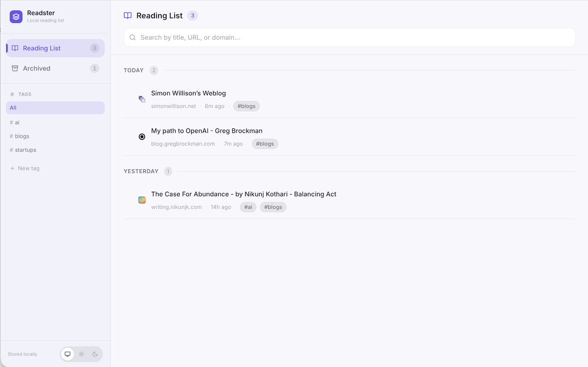
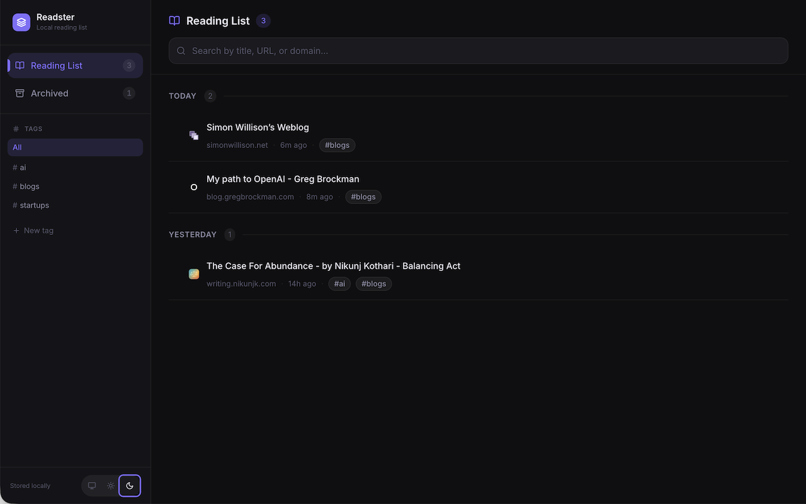
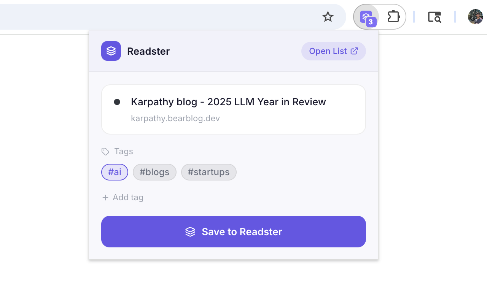

<p align="center">
  
</p>

<h1 align="center">Readster</h1>

<p align="center">
  A beautiful, local-first reading list manager for Chrome and Edge.<br/>
  Save pages with one click, organise with tags, and archive what you've read — all stored locally in your browser.
</p>

<p align="center">
  <a href="https://chromewebstore.google.com/detail/readster/boemmffhamfkcbonpjahedejonbgppnc">
    
  </a>
  &nbsp;
  <a href="https://github.com/bhrigu123/readster/releases/latest">
    
  </a>
</p>

<br/>

<p align="center">
  
</p>

---

## Install

<a href="https://chromewebstore.google.com/detail/readster/boemmffhamfkcbonpjahedejonbgppnc">
  
</a>

Or install manually from the [latest GitHub release](https://github.com/bhrigu123/readster/releases/latest).

---

## Features

- **One-click save** — click the toolbar icon on any page to save it instantly
- **Editable title** — rename pages before saving from the popup
- **Tag system** — create and filter by tags across your reading list
- **Archive flow** — check off items with a spring animation; they move to an archived view
- **Date grouping** — items organised as Today / Yesterday / This Week / Month Year
- **Real-time search** — filter by title, URL, or domain as you type
- **Theme support** — system, light, or dark — your choice
- **100% local** — everything lives in `chrome.storage.local`; no account, no server, no tracking

---

## Screenshots

<p align="center">
  
</p>
<p align="center">
  <em>Dark theme</em>
</p>

<br/>

<p align="center">
  
</p>
<p align="center">
  <em>Quick-save popup</em>
</p>

---

## Stack

| Concern | Choice |
|---|---|
| Extension framework | [WXT](https://wxt.dev) (Vite-powered, MV3) |
| UI | React 19 + TypeScript |
| Styling | Tailwind CSS v4 |
| Animations | Framer Motion |
| Icons | Lucide React |
| Storage | `chrome.storage.local` |
| Package manager | pnpm |

---

## Development

```bash
git clone https://github.com/bhrigu123/readster.git
cd readster
pnpm install
node scripts/generate-icons.mjs
pnpm dev
```

Then load `.output/chrome-mv3/` as an unpacked extension in `chrome://extensions` (enable Developer mode).

| Command | Description |
|---|---|
| `pnpm dev` | Dev server with HMR |
| `pnpm build` | Production build → `.output/chrome-mv3/` |
| `pnpm compile` | TypeScript type-check only |

> **Tip (macOS):** Chrome's file picker hides dot-folders by default.
> Press **`Cmd + Shift + .`** to reveal hidden files, then select `.output/chrome-mv3/`.

---

## Project structure

```
src/
├── entrypoints/
│   ├── background.ts       service worker — badge count, context menu
│   ├── popup/              toolbar popup — save current tab
│   └── dashboard/          full-page reading list UI
├── components/             shared React components
├── hooks/                  useReadingList, useSearch, useTheme
├── utils/                  storage, date grouping, URL helpers
└── types/                  shared TypeScript interfaces
```

---

## Releasing

```bash
npm version patch   # or minor / major — bumps package.json + creates git tag
git push origin main --tags
```

GitHub Actions picks up the tag, builds the extension, runs type-check, zips it, and attaches the zip to a GitHub Release automatically.

---

## Data & privacy

All data is stored exclusively in `chrome.storage.local` — a sandboxed area inside your browser profile. Nothing is sent to any server. Uninstalling the extension removes all data.

Read the full [Privacy Policy](PRIVACY.md).
